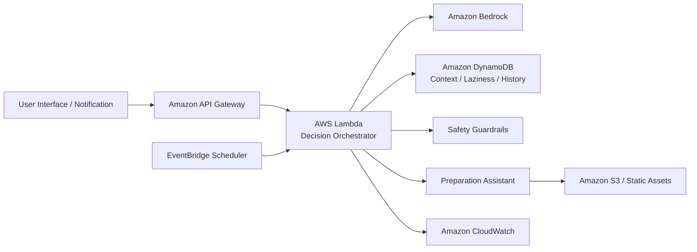

# Application Design

## Summary

T-AI-DA は、低リスクな日常判断を AI が一択で代行する AWS ベースの意思決定 OS である。MVP は朝の生活プラン生成と即決ボタンに絞り、Safety Guardrails によって高リスク判断を制限する。

## Design Goals

- 審査員が Intent、テーマ適合、AWS 構成、Unit 分解を短時間で追えること。
- Decision Orchestrator、User Context、Laziness Level、Safety Guardrails の責務が明確であること。
- Construction フェーズで MVP プロトタイプに移れる粒度であること。

## Architecture Summary

## Detailed Artifacts

- [Components](components.md)
- [Component Methods](component-methods.md)
- [Services](services.md)
- [Component Dependency](component-dependency.md)

## Requirements Coverage

| Requirement | Design Coverage |
| --- | --- |
| FR-001 | Morning Plan Service, Decision Orchestrator |
| FR-002 | Instant Decision Service, Decision Orchestrator |
| FR-003 | Laziness Level, User Context |
| FR-004 | Preparation Assistant, Preparation Service |
| FR-005 | Safety Guardrails, Safety Evaluation Service |
| NFR-001 | Safety Dependency Rule |
| NFR-002 | T-AI-DA Persona, explanation messages |
| NFR-003 | Morning Plan Service and Instant Decision Service response flow |
| NFR-004 | User Context data boundaries |
| NFR-005 | Service separation and external API adapters |

## Next Design Step

次の Units Generation では、この Application Design を Construction で扱える Unit of Work に分解する。特に Safety Guardrails と Decision Core は独立して検証可能な単位として扱う。
