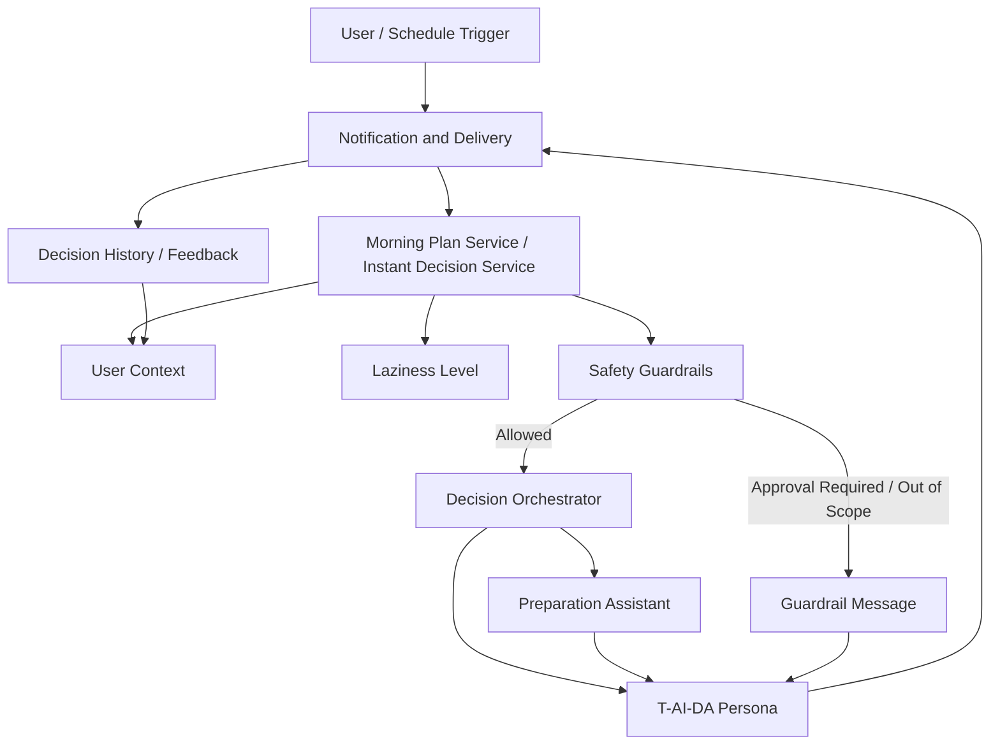

# Component Dependency

## Dependency Matrix

| From | Depends On | Reason |
| --- | --- | --- |
| Morning Plan Service | Decision Orchestrator | 朝の生活プランを統合生成するため。 |
| Morning Plan Service | User Context | 天気、予定、好み、予算を取得するため。 |
| Morning Plan Service | Safety Guardrails | 低リスク領域だけを自動決定するため。 |
| Morning Plan Service | Preparation Assistant | 判断後の準備支援を生成するため。 |
| Instant Decision Service | Decision Orchestrator | 即決判断を統合するため。 |
| Instant Decision Service | User Context | 曖昧な入力を登録済みの好み、予定、予算で補完するため。 |
| Instant Decision Service | Safety Guardrails | 高リスク判断を制限するため。 |
| Decision Orchestrator | User Context | 文脈に沿った判断を生成するため。 |
| Decision Orchestrator | Laziness Level | 委譲モードを決定するため。 |
| Decision Orchestrator | Safety Guardrails | 自動決定可否を確認するため。 |
| T-AI-DA Persona | Decision Orchestrator | 判断結果をユーザー向け表現に変換するため。 |
| Laziness Level | User Context | 軽量フィードバック履歴を参照するため。 |
| Preparation Assistant | User Context | 場所、予算、好みを準備候補に反映するため。 |
| Notification and Delivery | Morning Plan Service | 朝の結果を届けるため。 |
| Notification and Delivery | Instant Decision Service | 即決結果を届けるため。 |

## Data Flow

## Safety Dependency Rule

Decision Orchestrator は、Safety Guardrails の評価なしに自動決定を完了してはならない。Laziness Level が高い場合でも、Safety Guardrails が承認必須または対象外と判定した判断は自動化しない。
