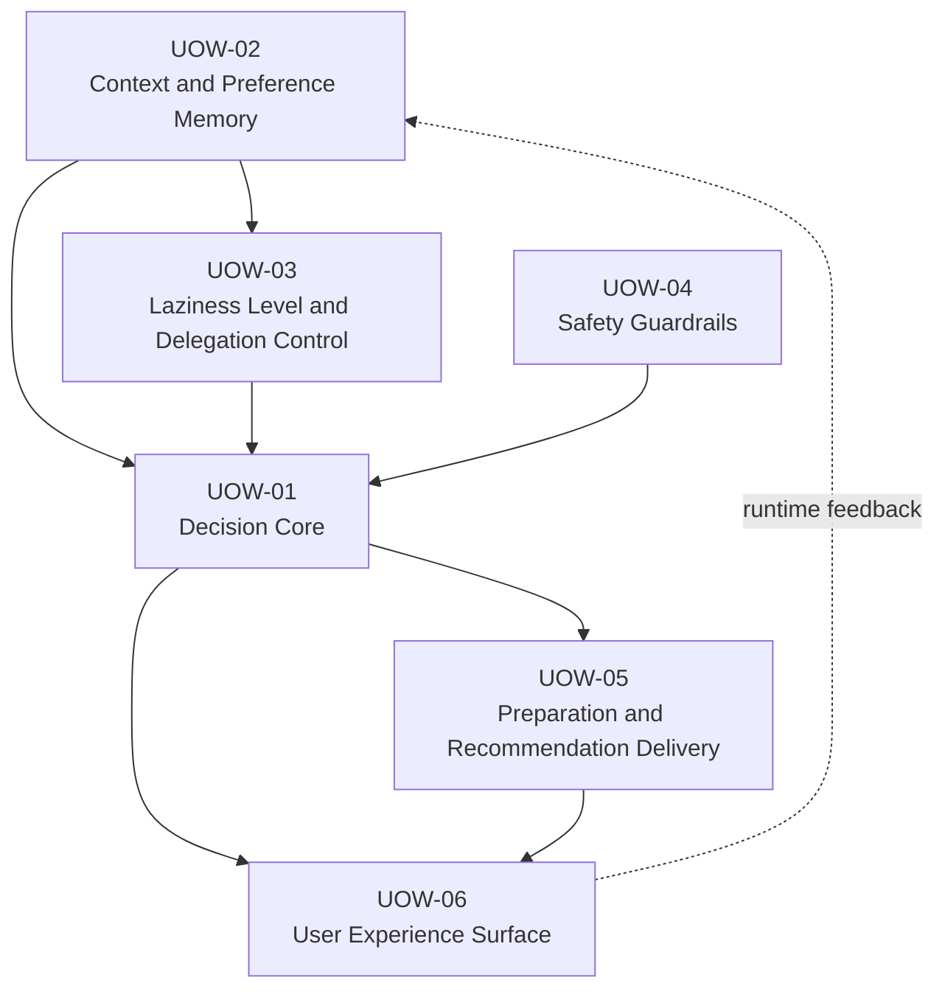

# Unit of Work Dependency

依存関係は、Construction フェーズの実装順序を決める **Build-time Dependency** と、運用時に Unit 間で流れる **Runtime Feedback Flow** に分けて整理する。Build-time Dependency には循環がない。

## Dependency Overview

実線は Build-time Dependency、破線は Runtime Feedback Flow を示す。Runtime Feedback Flow は、UOW-06 が捕捉したユーザー反応 (承認、却下、修正) を UOW-02 へ非同期に書き込む経路であり、UOW-02 の初期実装には不要なため、ビルド順依存には含めない。

## Build-time Dependency Table

| Unit | Depends On | Reason |
| --- | --- | --- |
| UOW-01 Decision Core | UOW-02 | 判断に必要なユーザー文脈を取得するため。 |
| UOW-01 Decision Core | UOW-03 | 委譲モードを反映するため。 |
| UOW-01 Decision Core | UOW-04 | 自動決定可否を確認するため。 |
| UOW-03 Laziness Level and Delegation Control | UOW-02 | 軽量フィードバック履歴を参照するため。 |
| UOW-05 Preparation and Recommendation Delivery | UOW-01 | 判断結果に基づき準備支援を生成するため。 |
| UOW-06 User Experience Surface | UOW-01 | 判断結果を表示するため。 |
| UOW-06 User Experience Surface | UOW-05 | 準備支援を表示するため。 |

## Runtime Feedback Flow Table

| From | To | Reason |
| --- | --- | --- |
| UOW-06 User Experience Surface | UOW-02 Context and Preference Memory | ユーザーの承認、却下、修正フィードバックを書き込み、後続の怠惰レベル判定に使うため。 |

## Implementation Order

Build-time Dependency に基づき、依存される側から順に実装する。Runtime Feedback Flow は UOW-06 完成後に有効化するため、ビルド順には影響しない。

1. UOW-02 Context and Preference Memory (初期はシードデータまたはモック)
2. UOW-04 Safety Guardrails
3. UOW-03 Laziness Level and Delegation Control
4. UOW-01 Decision Core
5. UOW-05 Preparation and Recommendation Delivery
6. UOW-06 User Experience Surface
7. UOW-06 から UOW-02 への Runtime Feedback Flow を有効化

## Safety Rule

UOW-01 は UOW-04 の評価なしに自動決定を完了しない。UOW-03 が低リスク自動決定型を返しても、UOW-04 が承認必須または対象外と判断した場合は自動化を停止する。
