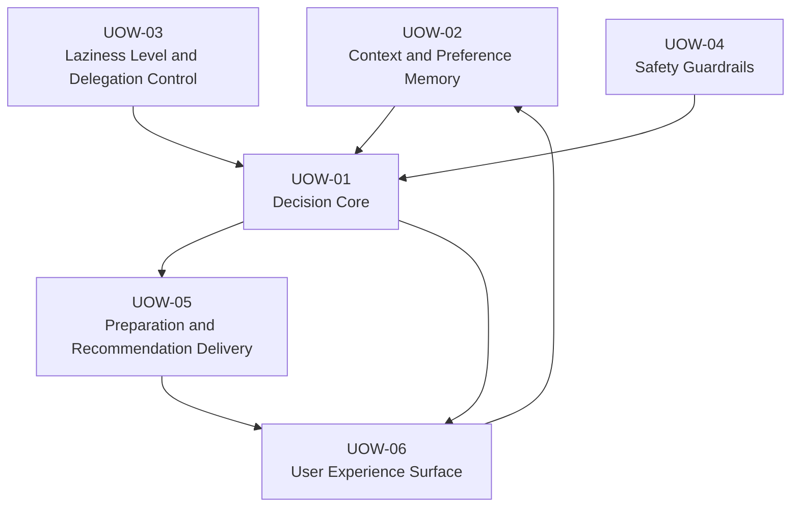

# Unit of Work Dependency

## Dependency Overview

## Dependency Table

| Unit | Depends On | Reason |
| --- | --- | --- |
| UOW-01 Decision Core | UOW-02 | 判断に必要なユーザー文脈を取得するため。 |
| UOW-01 Decision Core | UOW-03 | 委譲モードを反映するため。 |
| UOW-01 Decision Core | UOW-04 | 自動決定可否を確認するため。 |
| UOW-03 Laziness Level and Delegation Control | UOW-02 | 軽量フィードバック履歴を参照するため。 |
| UOW-05 Preparation and Recommendation Delivery | UOW-01 | 判断結果に基づき準備支援を生成するため。 |
| UOW-06 User Experience Surface | UOW-01 | 判断結果を表示するため。 |
| UOW-06 User Experience Surface | UOW-05 | 準備支援を表示するため。 |
| UOW-02 Context and Preference Memory | UOW-06 | ユーザーの承認、却下、修正フィードバックを保存するため。 |

## Implementation Order

1. UOW-02 Context and Preference Memory
2. UOW-04 Safety Guardrails
3. UOW-03 Laziness Level and Delegation Control
4. UOW-01 Decision Core
5. UOW-05 Preparation and Recommendation Delivery
6. UOW-06 User Experience Surface

## Safety Rule

UOW-01 は UOW-04 の評価なしに自動決定を完了しない。UOW-03 が低リスク自動決定型を返しても、UOW-04 が承認必須または対象外と判断した場合は自動化を停止する。
