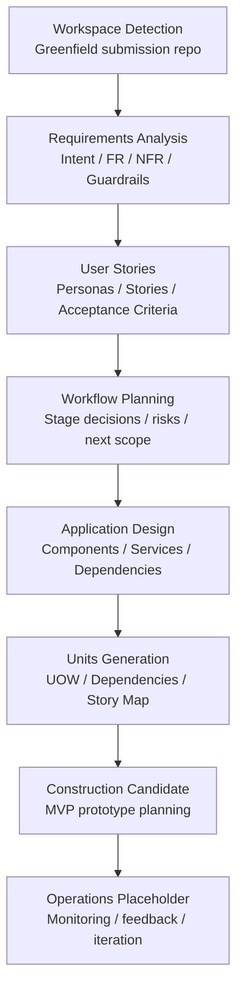

# Execution Plan

## Detailed Analysis Summary

T-AI-DA は、日常の小さな意思決定に疲れた一人暮らしのビジネスパーソン向けに、低リスクな生活判断を AI が一択で代行するサービスである。

Inception では、ハッカソン書類審査で評価される以下を明確にする。

- Business Intent: 決断疲れと選択肢過多を解消し、日常の判断コストを下げる。
- Theme Fit: 「怠惰レベル」により、使うほど意思決定を委譲する体験を表現する。
- Unit Decomposition: Decision Orchestrator、User Context、Laziness Level、Safety Guardrails などに責務を分ける。
- Document Quality: README と `aidlc-docs/` の成果物を相互リンクし、審査員が短時間で追える構造にする。

## Change Impact Assessment

このリポジトリは Greenfield のドキュメントパッケージであり、既存アプリケーションコードへの影響はない。

| Area | Impact |
| --- | --- |
| README | 審査員向け入口として T-AI-DA の概要と成果物リンクを提供する。 |
| Requirements | Intent、機能要件、非機能要件、安全境界を定義する。 |
| User Stories | MVP 体験と Safety Guardrails をユーザー視点で具体化する。 |
| Application Design | AWS ベースの構成とコンポーネント責務を整理する。 |
| Units Generation | Construction フェーズで実装可能な作業単位へ分解する。 |

## Risk Assessment

| Risk | Mitigation |
| --- | --- |
| 「意思決定を奪う」表現が無責任な自動化に見える | MVP は低リスク領域に限定し、Safety Guardrails を全成果物で明示する。 |
| AI コンシェルジュとの差別化が弱くなる | 怠惰レベルを中核メカニクスとして、テーマ適合性を前面に出す。 |
| Unit 分解が抽象的になりすぎる | User Stories と Unit of Work を対応表で接続する。 |
| README のリンク先が不足する | Inception 成果物を `aidlc-docs/` 配下に揃え、最終検証で必須ファイルの存在を確認する。 |
| 将来拡張が MVP スコープを膨らませる | MVP と Future Scope を分離し、高リスク判断は対象外または承認必須にする。 |

## Phase Determination

| Stage | Decision | Reason |
| --- | --- | --- |
| Workspace Detection | EXECUTE | Greenfield であり、提出リポジトリ構造を確認する必要がある。 |
| Reverse Engineering | SKIP | 既存アプリケーションは存在せず、解析対象コードがない。 |
| Requirements Analysis | EXECUTE | 書類審査で Business Intent の明確さが評価される。 |
| User Stories | EXECUTE | MVP 体験と Safety Guardrails をユーザー視点で明確にする必要がある。 |
| Workflow Planning | EXECUTE | Inception の成果物全体を審査基準に対応させる必要がある。 |
| Application Design | EXECUTE | AWS 構成案とコンポーネント責務を示す必要がある。 |
| Units Generation | EXECUTE | 書類審査基準に Unit 分解の適切さが含まれるため必須とする。 |

## Workflow Visualization

## Recommended Construction Scope

Construction フェーズに進む場合は、以下を MVP プロトタイプ候補とする。

1. 朝の生活プラン生成
   - 入力: 天気、予定、好み、予算、軽量フィードバック履歴
   - 出力: 食事、服装、買い物候補、夜の過ごし方、準備支援

2. 即決ボタン
   - 入力: ユーザーの迷い、現在の文脈
   - 出力: 一択の判断、短い理由、準備ステップ

3. Safety Guardrails
   - 入力: 判断対象、金額、健康・法律・雇用・人間関係への影響
   - 出力: 自動決定可、承認必須、対象外

4. 怠惰レベル
   - 入力: 承認、却下、修正などの軽量フィードバック
   - 出力: 提案型、半自動型、低リスク自動決定型の制御

## Completion Criteria

- Requirements、User Stories、Application Design、Units Generation の各成果物が存在する。
- README から主要成果物へリンクできる。
- Unit of Work が User Stories と Requirements に接続している。
- Safety Guardrails が全フェーズにまたがって追跡できる。
